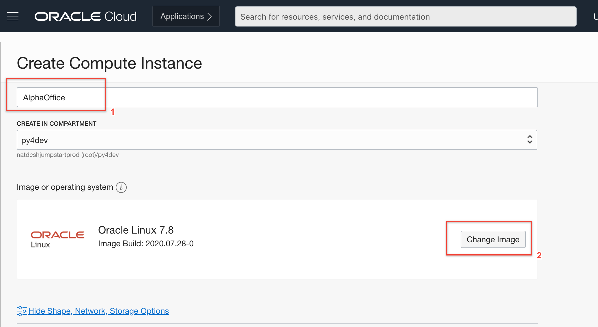

## Step 1: Create Compartment

1.  Click on left hamburger menu -> Identity -> Compartments

2. Click on **Create Compartment**

3. Give Name and Description and click on **Create Compartment**.

## Step 2: Create Instance 

1. Click on left hamburger menu -> Compute -> Instances

2. Click on **Create Instance** and make sure you are in right compartment.

3. Give name and click on **Change Image**

4. Click on **Oracle Images** tab.

5. Select **Oracle Cloud Developer Image**, check the terms and click on **Select Image**

6. Download the auto-generated keys or you can use your own keys. After filling all the details it should look something like following image. Click on **Create**

## Step 3: SSH into instance and setup VNC

1. SSH into instance with command 

   `ssh -i <path_to_private_key> opc@<public_ip_address>`

2. After ssh type `vncpasswd` enter password and press `n` when asked for view-only password.

3. Type `vncserver` and it should return output similar to following image.

## Step 4: Accessing a Graphical User Interface (GUI) via VNC

To access a GUI via VNC, do the following:

1. On your local computer, connect to your instance and create an ssh tunnel for port 5901 (for display number 1): `$ ssh -L 5901:localhost:5901 –i id_rsa opc@<IP Address>`

2. On your local computer, start a VNC viewer and establish a VNC connection to` localhost:1`

3. Enter the VNC password you set earlier

## Step 5: Create Autonomous Database

1. Click on left hamburger menu -> Autonomous Transaction Processing

2. Makes sure you are in right compartment and click on **Create Autonomous Database**

3. Enter Display name and Database name and scroll down

4. Enter Password and confirm password

5. After filling all the details, it should look something like following image. Click on **Create Autonomous Database**

## Step 6: Create Object Storage

1. Click on left hamburger menu -> Object Storage -> Object Storage

2. Make sure you are in right compartment and click on **Create Bucket**

3. Enter Bucket name and click on **Create Bucket**

